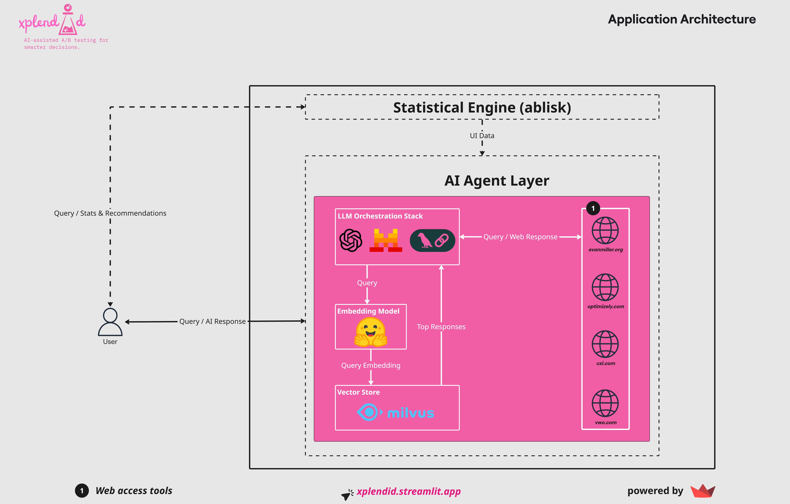

# xplendid

  

**xplendid** is an AI-assisted web application for **designing, analysing, and making decisions on A/B tests**. It helps you go from raw data to actionable insights with ease.

  

---

  

🧪 Try **xplendid** [live](https://xplendid.streamlit.app)!

  

---
  

<p  align="center">


</p>

  

---  

## Key Features

  

- 🤖 **AI-assisted recommendations**: get smart suggestions on test design, sample sizes, and metrics.

- 📊 **Interactive visualizations**: instantly see how your variants perform.

- ✔️ **Decision support**: understand whether your results are statistically and practically significant.
-  Below is presented the architecture:
---

  

<p  align="center">



</p>

  

---

  

## The `ablisk` Module

  

**xplendid** has **[ablisk](https://pypi.org/project/ablisk/)** as its statistical engine, a Python module for A/B tests. Both **xplendid** and **ablisk** are heavily inspired by [Evan Miller's work](https://www.evanmiller.org/ab-testing/sample-size.html) on A/B testing and sample size calculations.

  

If you want to run A/B tests directly in Python without using **xplendid**, you can install **ablisk** via pip:

  

```bash

pip  install  ablisk